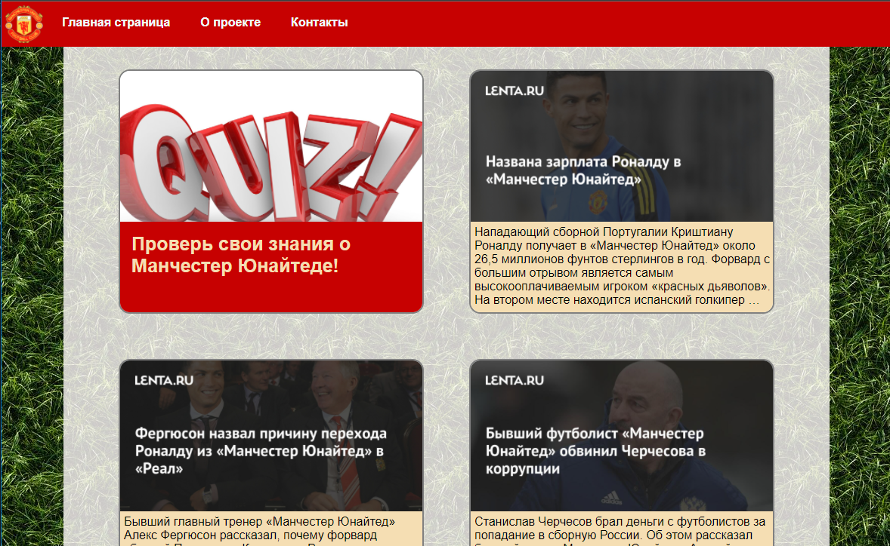
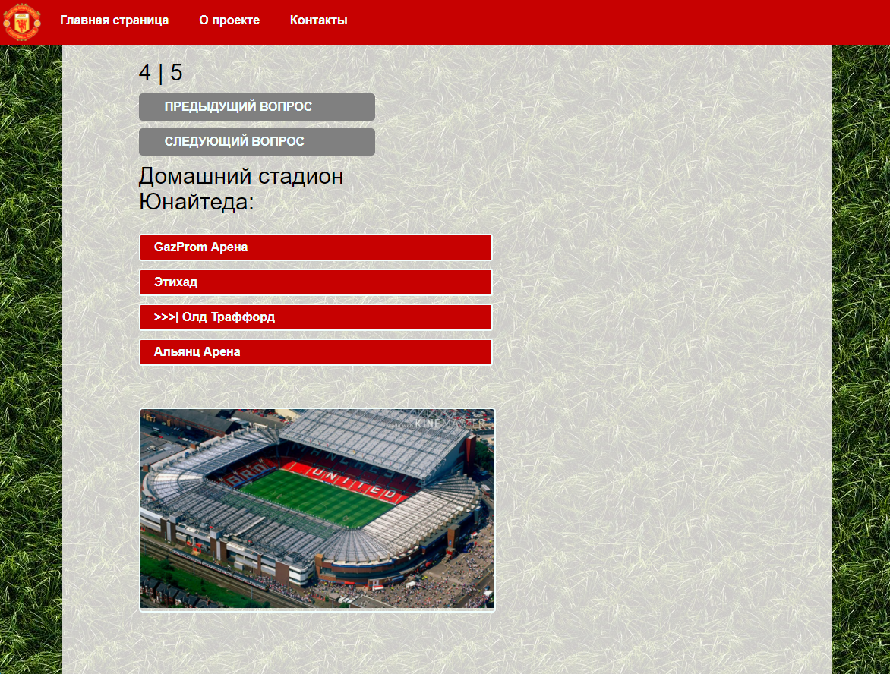
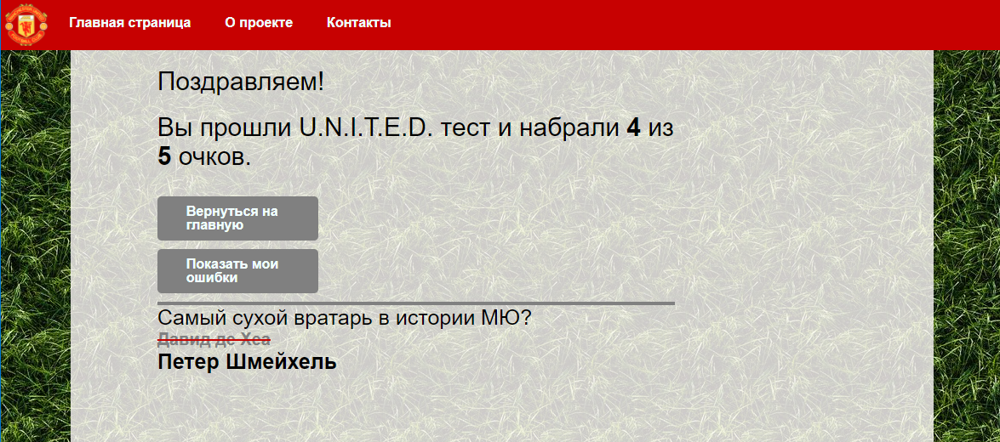

<h1 align="center">ManUtd QUIZ</h1>
<h2 align="center">

<p align="center"></p>

___
## Description

**Quiz test**

This is a quiz test to test your knowledge of the history of the Manchester United club.

___

## How to use
- **Open** the quiz by clicking on the corresponding heading.
- **Choose** the correct answer and click on the "next" button..
<p align="center"></p>

- **Complete** the test.
- **After** completing the test, you can look at your mistakes.
<p align="center"></p>


___

## About the project.

### Technology stack

- React (hooks)
- Redux
- HTML, CSS, axios and etc, the whole list can be found in **package.json**

___

## Project setup
- **Important!**

Before starting the project, make sure that the port **localhost:3000** is open.

- **Make** sure you have installed **yarn**.

- Run yarn and application on port 3000.
```
yarn
yarn start
```

___

## Future scope

Plans for the distant future 

- Add backend (Node)

- PSQL <> Node <> React
- Create a common backend with [telegram bot](https://github.com/KirillYashin/MU_Quiz_TGBot "MU Telegram quiz bot")
a telegram bot.
- Store questions data not in react, but in hooks.
